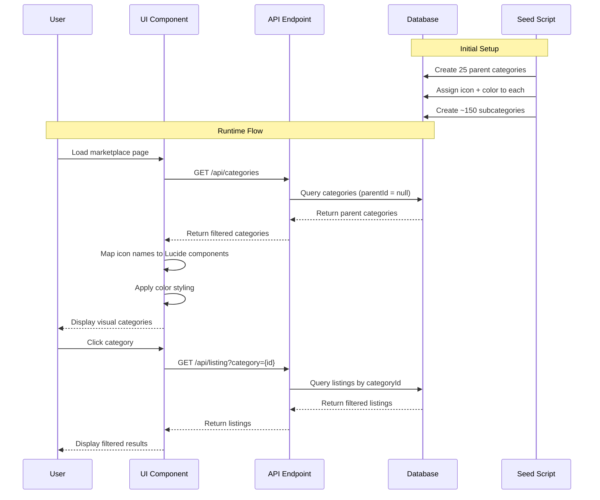

# Design Document: Marketplace Category Visual System

## Overview

The Marketplace Category Visual System enhances the user experience by providing visual distinction for 25 main product categories through icons and colors. Each category is assigned a Lucide icon name and hex color code stored in the database, enabling consistent visual representation across the marketplace interface. The system supports a hierarchical category structure with parent categories and subcategories, where visual enhancements are primarily applied to parent categories for navigation and filtering.

This design captures the current implementation status and documents the complete architecture for the category visual enhancement system.

## Architecture

```mermaid
graph TD
    A[Database Layer] --> B[Prisma Schema]
    B --> C[Category Model]
    C --> D[icon: String]
    C --> E[color: String]
    C --> F[parentId: String?]
    
    G[Seed System] --> H[seed-categories.ts]
    H --> I[25 Parent Categories]
    H --> J[~150 Subcategories]
    I --> K[Icon + Color Data]
    
    L[API Layer] --> M[/api/categories]
    M --> N[Filter Parent Categories]
    
    O[UI Components] --> P[CategorySection]
    O --> Q[Marketplace Sidebar]
    P --> R[Lucide Icon Rendering]
    P --> S[Color Styling]
    Q --> T[Gradient Active State]
    
    C --> M
    M --> O
    K --> C
    
    style C fill:#3B82F6
    style K fill:#10B981
    style O fill:#8B5CF6
```

## Sequence Diagrams

### Category Data Flow



## Components and Interfaces

### Component 1: Category Model (Database)

**Purpose**: Store category data with visual enhancement fields

**Interface**:
```typescript
interface Category {
  id: string
  name: string
  slug: string
  description: string | null
  icon: string | null          // Lucide icon name (e.g., "Smartphone", "Camera")
  color: string | null         // Hex color code (e.g., "#3B82F6")
  iconUrl: string | null
  imageBannerUrl: string | null
  parentId: string | null      // Null for parent categories
  sortOrder: number
  isActive: boolean
  isFeatured: boolean
  listingCount: number
  umkmCount: number
  keywords: string | null
  metaTitle: string | null
  metaDescription: string | null
  createdAt: Date
  updatedAt: Date
  
  // Relations
  parent?: Category
  children?: Category[]
  listings?: Listing[]
}
```

**Responsibilities**:
- Store category hierarchy (parent/child relationships)
- Store visual enhancement data (icon, color)
- Track category metrics (listingCount, umkmCount)
- Support SEO metadata


### Component 2: Seed Script

**Purpose**: Populate database with 25 categories and visual data

**Interface**:
```typescript
interface CategorySeedData {
  name: string
  slug: string
  description: string
  icon: string              // Lucide icon name
  color: string             // Hex color code
  subcategories: Array<{
    name: string
    slug: string
  }>
}

async function seedCategories(categories: CategorySeedData[]): Promise<void>
```

**Responsibilities**:
- Create 25 parent categories with icons and colors
- Create ~6 subcategories per parent category
- Use upsert to prevent duplicates
- Maintain data consistency

**Category Data Structure**:
```typescript
const categories: CategorySeedData[] = [
  {
    name: 'Elektronik',
    slug: 'elektronik',
    description: 'Perangkat elektronik dan gadget',
    icon: 'Zap',
    color: '#3B82F6', // Blue
    subcategories: [
      { name: 'Audio', slug: 'audio' },
      { name: 'Headphone & Earphone', slug: 'headphone-earphone' },
      // ... 4 more subcategories
    ]
  },
  // ... 24 more parent categories
]
```

### Component 3: Category API Endpoint

**Purpose**: Provide category data to frontend with filtering

**Interface**:
```typescript
// GET /api/categories
interface CategoryAPIResponse {
  categories: Category[]
  total: number
}

interface CategoryQueryParams {
  parentOnly?: boolean      // Filter only parent categories
  includeInactive?: boolean // Include inactive categories
  search?: string          // Search by name
}
```

**Responsibilities**:
- Query categories from database
- Filter parent categories (parentId = null)
- Return category data with icon and color fields
- Support search and filtering

### Component 4: CategorySection Component

**Purpose**: Display category icons in horizontal scrollable carousel

**Interface**:
```typescript
interface CategorySectionProps {
  categories?: Category[]
}

interface CategoryIconMapping {
  [slug: string]: LucideIcon
}

interface CategoryColorMapping {
  [slug: string]: string  // Tailwind color classes
}
```

**Responsibilities**:
- Render horizontal scrollable category carousel
- Map icon names to Lucide React components
- Apply solid background colors to circular icons
- Handle scroll navigation with arrow buttons
- Link to marketplace with category filter

**Visual Design**:
- Circular icon containers (64x64px)
- Solid color backgrounds with hover effects
- White icon color for contrast
- Hover scale animation (110%)
- Shadow effects for depth

### Component 5: Marketplace Sidebar

**Purpose**: Display category filter list with active state styling

**Interface**:
```typescript
interface MarketplaceSidebarProps {
  categories: Category[]
  selectedCategory: string | null
  onCategorySelect: (categoryId: string | null) => void
}
```

**Responsibilities**:
- Display vertical list of parent categories
- Highlight active category with gradient
- Filter listings by selected category
- Show "Semua Kategori" (All Categories) option

**Active State Styling**:
```typescript
const activeGradient = 'bg-gradient-to-r from-blue-600 via-purple-600 to-purple-700 text-white font-semibold shadow-md'
const inactiveState = 'hover:bg-muted'
```

## Data Models

### Category Model (Prisma Schema)

```prisma
model Category {
  id              String    @id @default(cuid())
  name            String
  slug            String    @unique
  description     String?
  icon            String?   // Lucide icon name
  color           String?   // Hex color code
  iconUrl         String?
  imageBannerUrl  String?
  parentId        String?
  sortOrder       Int       @default(0)
  isActive        Boolean   @default(true)
  isFeatured      Boolean   @default(false)
  listingCount    Int       @default(0)
  umkmCount       Int       @default(0)
  keywords        String?
  metaTitle       String?
  metaDescription String?
  createdAt       DateTime  @default(now())
  updatedAt       DateTime  @updatedAt

  parent      Category?  @relation("CategoryHierarchy", fields: [parentId], references: [id])
  children    Category[] @relation("CategoryHierarchy")
  listings    Listing[]
  umkmProfiles UmkmProfile[]
  products    Product[]

  @@map("categories")
}
```

**Validation Rules**:
- `slug` must be unique across all categories
- `icon` should be a valid Lucide icon name (validated at seed time)
- `color` should be a valid hex color code (e.g., "#3B82F6")
- `parentId` null indicates parent category
- Parent categories should have `icon` and `color` populated


### 25 Parent Categories with Icons & Colors

| Category | Slug | Icon | Color | Subcategories |
|----------|------|------|-------|---------------|
| Elektronik | elektronik | Zap | #3B82F6 (Blue) | 6 |
| Handphone & Aksesoris | handphone-aksesoris | Smartphone | #8B5CF6 (Purple) | 6 |
| Komputer & Aksesoris | komputer-aksesoris | Monitor | #06B6D4 (Cyan) | 6 |
| Kamera | kamera | Camera | #EC4899 (Pink) | 6 |
| TV & Home Entertainment | tv-home-entertainment | Tv | #F59E0B (Amber) | 6 |
| Peralatan Rumah Tangga | peralatan-rumah-tangga | Home | #10B981 (Emerald) | 6 |
| Rumah & Dekorasi | rumah-dekorasi | Sofa | #EF4444 (Red) | 6 |
| Dapur | dapur | ChefHat | #F97316 (Orange) | 6 |
| Makanan & Minuman | makanan-minuman | UtensilsCrossed | #84CC16 (Lime) | 6 |
| Kesehatan | kesehatan | Heart | #14B8A6 (Teal) | 6 |
| Kecantikan | kecantikan | Sparkles | #A855F7 (Purple) | 6 |
| Perawatan Pria | perawatan-pria | User | #6366F1 (Indigo) | 6 |
| Ibu & Bayi | ibu-bayi | Baby | #F472B6 (Pink) | 6 |
| Fashion Wanita | fashion-wanita | Shirt | #EC4899 (Pink) | 6 |
| Fashion Pria | fashion-pria | ShirtIcon | #0EA5E9 (Sky Blue) | 6 |
| Fashion Muslim | fashion-muslim | Moon | #059669 (Green) | 6 |
| Sepatu Wanita | sepatu-wanita | Footprints | #D946EF (Fuchsia) | 6 |
| Sepatu Pria | sepatu-pria | Footprints | #0284C7 (Blue) | 6 |
| Tas Wanita | tas-wanita | ShoppingBag | #DB2777 (Pink) | 6 |
| Tas Pria | tas-pria | Briefcase | #0891B2 (Cyan) | 6 |
| Jam Tangan | jam-tangan | Watch | #7C3AED (Violet) | 6 |
| Olahraga & Outdoor | olahraga-outdoor | Dumbbell | #DC2626 (Red) | 6 |
| Otomotif | otomotif | Car | #EA580C (Orange) | 6 |
| Hobi & Koleksi | hobi-koleksi | Gamepad2 | #7C3AED (Violet) | 6 |
| Buku & Alat Tulis | buku-alat-tulis | BookOpen | #CA8A04 (Yellow) | 6 |

## Icon Mapping System

### Lucide Icon Integration

**Purpose**: Map database icon names to Lucide React components

**Implementation**:
```typescript
import * as LucideIcons from 'lucide-react';

// Dynamic icon mapping
const iconMap: Record<string, LucideIcon> = {
  'Zap': LucideIcons.Zap,
  'Smartphone': LucideIcons.Smartphone,
  'Monitor': LucideIcons.Monitor,
  'Camera': LucideIcons.Camera,
  'Tv': LucideIcons.Tv,
  'Home': LucideIcons.Home,
  'Sofa': LucideIcons.Sofa,
  'ChefHat': LucideIcons.ChefHat,
  'UtensilsCrossed': LucideIcons.UtensilsCrossed,
  'Heart': LucideIcons.Heart,
  'Sparkles': LucideIcons.Sparkles,
  'User': LucideIcons.User,
  'Baby': LucideIcons.Baby,
  'Shirt': LucideIcons.Shirt,
  'ShirtIcon': LucideIcons.Shirt,
  'Moon': LucideIcons.Moon,
  'Footprints': LucideIcons.Footprints,
  'ShoppingBag': LucideIcons.ShoppingBag,
  'Briefcase': LucideIcons.Briefcase,
  'Watch': LucideIcons.Watch,
  'Dumbbell': LucideIcons.Dumbbell,
  'Car': LucideIcons.Car,
  'Gamepad2': LucideIcons.Gamepad2,
  'BookOpen': LucideIcons.BookOpen,
};

// Get icon component by name
function getIconComponent(iconName: string | null): LucideIcon {
  if (!iconName) return LucideIcons.MoreHorizontal;
  return iconMap[iconName] || LucideIcons.MoreHorizontal;
}
```

### Color Application

**Purpose**: Apply hex colors to UI elements

**Implementation Options**:

1. **Inline Styles** (Current):
```typescript
<div style={{ backgroundColor: category.color }}>
  <Icon className="text-white" />
</div>
```

2. **Tailwind Classes** (Fallback):
```typescript
const colorMap: Record<string, string> = {
  '#3B82F6': 'bg-blue-500',
  '#8B5CF6': 'bg-purple-500',
  // ... more mappings
};
```

3. **CSS Variables** (Future Enhancement):
```typescript
<div style={{ '--category-color': category.color } as React.CSSProperties}>
  <div className="bg-[var(--category-color)]">
    <Icon />
  </div>
</div>
```

## Error Handling

### Error Scenario 1: Missing Icon/Color Data

**Condition**: Category in database has null icon or color field
**Response**: Use fallback icon (MoreHorizontal) and default color (#CCCCCC)
**Recovery**: Log warning and continue rendering with defaults

```typescript
const Icon = getIconComponent(category.icon) || MoreHorizontal;
const color = category.color || '#CCCCCC';
```

### Error Scenario 2: Invalid Icon Name

**Condition**: Icon name in database doesn't match any Lucide icon
**Response**: Use fallback icon (MoreHorizontal)
**Recovery**: Log error with category details for debugging

```typescript
try {
  const Icon = iconMap[category.icon];
  if (!Icon) throw new Error(`Invalid icon: ${category.icon}`);
} catch (error) {
  console.error(`Category ${category.name}: ${error.message}`);
  return MoreHorizontal;
}
```

### Error Scenario 3: Seed Script Failure

**Condition**: Database connection fails or constraint violation during seeding
**Response**: Rollback transaction and log detailed error
**Recovery**: Provide troubleshooting steps in error message

```typescript
try {
  await prisma.category.upsert({ ... });
} catch (error) {
  console.error('Seed failed:', error);
  console.log('Troubleshooting:');
  console.log('1. Run: npx prisma generate');
  console.log('2. Run: npx prisma db push');
  console.log('3. Retry: npx tsx prisma/seed-categories.ts');
  process.exit(1);
}
```

### Error Scenario 4: API Query Failure

**Condition**: Database query fails when fetching categories
**Response**: Return empty array with error status
**Recovery**: Frontend displays empty state with retry option

```typescript
try {
  const categories = await prisma.category.findMany({ ... });
  return { categories, total: categories.length };
} catch (error) {
  console.error('Category query failed:', error);
  return { categories: [], total: 0, error: error.message };
}
```


## Testing Strategy

### Unit Testing Approach

**Database Layer**:
- Test category model CRUD operations
- Verify icon and color field storage
- Test parent-child relationship queries
- Validate unique slug constraint

**Seed Script**:
- Test category creation with icon/color
- Verify subcategory parent relationship
- Test upsert behavior (no duplicates)
- Validate all 25 categories created

**API Endpoints**:
- Test category filtering (parentOnly)
- Test search functionality
- Verify response format
- Test error handling

**UI Components**:
- Test icon mapping function
- Test color application
- Test category selection
- Test scroll navigation

### Integration Testing Approach

**End-to-End Category Flow**:
1. Seed database with categories
2. Query categories via API
3. Render CategorySection component
4. Verify icons and colors displayed
5. Click category and verify navigation
6. Verify marketplace filters by category

**Visual Regression Testing**:
- Capture screenshots of CategorySection
- Verify icon rendering for all 25 categories
- Verify color consistency
- Test responsive layout

### Manual Testing Checklist

- [ ] All 25 parent categories display with correct icons
- [ ] All 25 parent categories display with correct colors
- [ ] Category carousel scrolls smoothly
- [ ] Hover effects work on category icons
- [ ] Clicking category navigates to marketplace
- [ ] Marketplace sidebar shows active category with gradient
- [ ] Subcategories are not shown in main navigation
- [ ] Fallback icon displays for missing icon data
- [ ] Mobile responsive layout works correctly

## Performance Considerations

### Database Optimization

**Indexing Strategy**:
- Index on `slug` (unique) for fast lookups
- Index on `parentId` for hierarchy queries
- Index on `isActive` for filtering

**Query Optimization**:
```typescript
// Efficient parent category query
const parentCategories = await prisma.category.findMany({
  where: { parentId: null, isActive: true },
  select: {
    id: true,
    name: true,
    slug: true,
    icon: true,
    color: true,
    listingCount: true,
  },
  orderBy: { sortOrder: 'asc' },
});
```

### Frontend Optimization

**Icon Loading**:
- Use tree-shaking to import only needed Lucide icons
- Lazy load icons for better initial page load
- Cache icon components in memory

**Rendering Performance**:
- Use React.memo for CategorySection component
- Virtualize category list if count exceeds 50
- Debounce scroll event handlers

**Caching Strategy**:
- Cache category data in React Query/SWR
- Set stale time to 5 minutes (categories rarely change)
- Implement optimistic updates for category selection

## Security Considerations

### Input Validation

**Icon Name Validation**:
- Whitelist valid Lucide icon names
- Reject any icon names not in whitelist
- Sanitize icon names before database storage

**Color Validation**:
- Validate hex color format (#RRGGBB)
- Reject invalid color codes
- Sanitize color values before rendering

### Access Control

**Category Management**:
- Only admin users can create/edit categories
- Validate user permissions before seed operations
- Log all category modifications in audit log

**API Security**:
- Rate limit category API endpoints
- Validate query parameters
- Prevent SQL injection in search queries

## Dependencies

### External Libraries

**Lucide React** (v0.x):
- Purpose: Icon library for category icons
- Usage: Import and render icon components
- License: ISC

**Prisma** (v6.x):
- Purpose: Database ORM
- Usage: Category model and queries
- Note: Downgraded from v7 due to compatibility issues

**Next.js** (v15.x):
- Purpose: React framework
- Usage: App Router, API routes, server components

**Tailwind CSS** (v3.x):
- Purpose: Styling framework
- Usage: Color classes, responsive design

### Internal Dependencies

**Database**:
- PostgreSQL (via Supabase)
- Connection via DATABASE_URL and DIRECT_URL

**Existing Models**:
- Listing model (foreign key to Category)
- UmkmProfile model (foreign key to Category)
- Product model (foreign key to Category)

## Implementation Status

### Completed ✅

1. **Database Schema**: Category model with icon and color fields
2. **Seed Script**: 25 categories with icons, colors, and subcategories
3. **Marketplace Page**: Filters parent categories only in sidebar
4. **Check Script**: Verification tool for category structure
5. **CategorySection Component**: Horizontal carousel with icons and colors
6. **Marketplace Sidebar**: Active category gradient styling
7. **Icon Mapping**: Lucide icon integration in UI components

### Remaining Work 🚧

1. **Dynamic Icon Rendering**: Update CategorySection to use database icon/color instead of hardcoded mappings
2. **API Enhancement**: Add parentOnly filter to /api/categories endpoint
3. **Error Handling**: Implement fallback logic for missing icon/color data
4. **Testing**: Add unit and integration tests for category system
5. **Documentation**: Create admin guide for managing categories

### Future Enhancements 🔮

1. **Admin UI**: Category management interface for adding/editing categories
2. **Icon Upload**: Support custom icon uploads in addition to Lucide icons
3. **Color Picker**: Visual color picker for category color selection
4. **Category Analytics**: Track category popularity and usage metrics
5. **Subcategory Icons**: Extend icon/color system to subcategories
6. **Category Images**: Support banner images for category pages
7. **Localization**: Multi-language support for category names

## Migration Guide

### For Existing Installations

If you have an existing marketplace installation without the category visual system:

1. **Update Database Schema**:
```bash
npx prisma db push
```

2. **Run Seed Script**:
```bash
npx tsx prisma/seed-categories.ts
```

3. **Verify Categories**:
```bash
npx tsx check-categories.ts
```

4. **Update UI Components**:
- Replace hardcoded category icons with database-driven icons
- Update CategorySection to fetch icon/color from API
- Test all category-related pages

### Rollback Procedure

If you need to rollback the changes:

1. **Remove icon/color fields** from Category model in schema.prisma
2. **Run migration**:
```bash
npx prisma db push
```

3. **Revert UI components** to use hardcoded icon mappings

## Troubleshooting

### Issue: Categories not displaying icons

**Symptoms**: Categories show fallback icon (MoreHorizontal) instead of assigned icons

**Possible Causes**:
- Seed script not run
- Icon names in database don't match Lucide icon names
- Icon mapping not implemented in UI component

**Solutions**:
1. Run check script: `npx tsx check-categories.ts`
2. Verify icon field populated in database
3. Check icon mapping in CategorySection component
4. Re-run seed script if needed

### Issue: Colors not applying

**Symptoms**: All categories show same color or default gray

**Possible Causes**:
- Color field not populated in database
- Inline styles not applied correctly
- CSS specificity issues

**Solutions**:
1. Verify color field in database has hex values
2. Check inline style application in component
3. Inspect element in browser DevTools
4. Re-run seed script if needed

### Issue: Subcategories showing in main navigation

**Symptoms**: More than 25 categories displayed in carousel/sidebar

**Possible Causes**:
- API not filtering by parentId
- UI component not filtering parent categories

**Solutions**:
1. Add filter in API: `where: { parentId: null }`
2. Filter in UI: `categories.filter(cat => !cat.parentId)`
3. Verify query in API endpoint

## Conclusion

The Marketplace Category Visual System provides a robust, scalable solution for visually distinguishing product categories in the marketplace. With 25 parent categories, each with unique icons and colors, users can quickly identify and navigate to their desired product categories. The system is built on a solid foundation with proper database schema, seed scripts, and UI components, ready for future enhancements and customization.
